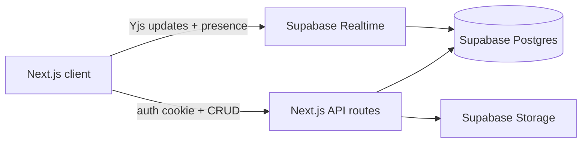

# Workgether — Lightweight Collaborative Docs

## Locked decisions

| Area       | Choice                                                                            |
| ---------- | --------------------------------------------------------------------------------- |
| Auth       | Username + password; auto-create if new; error if wrong password; no seeded users |
| Editor     | TipTap (bold, italic, underline, headings, lists)                                 |
| DB / files | Supabase Postgres + Storage + Realtime                                            |
| Share      | Per-document share link; Viewer or Editor                                         |
| Save       | Manual Save + debounced autosave                                                  |
| Upload     | Home → new doc; Editor → attachments **and** import content                       |
| Collab     | Prefer true realtime + presence (free); soft sync if realtime provider fails      |
| Deploy     | Vercel                                                                            |

## Architecture

**Stack:** Next.js (App Router) + TypeScript + Tailwind + TipTap + Yjs + `@supabase/supabase-js` + `@supabase-labs/y-supabase` (community Yjs provider over Realtime broadcast). Session: signed HTTP-only cookie (e.g. `jose` + `bcryptjs`). Server uses Supabase service role for mutations that need trust; client uses anon key only for Realtime channels after access is verified.

**Why this over TipTap Cloud / Liveblocks:** TipTap Cloud is paid; Vercel has no long-lived WebSocket server. Yjs + Supabase Realtime stays on the free tier and gives cursors/presence. If the provider proves unstable during Phase 5, fall back to soft sync: debounced autosave + Postgres `UPDATE` subscription + Presence-only indicators (documented in the architecture note).

## Data model (Supabase)

- `**users**`: `id`, `username` (unique), `password_hash`, `created_at`
- `**documents**`: `id`, `title`, `owner_id`, `content_json` (TipTap JSON fallback/export), `yjs_state` (bytea/base64 for collab persistence), `share_token` (unique, nullable until shared), `share_role` (`viewer`  `editor`  null), `created_at`, `updated_at`
- `**attachments**`: `id`, `document_id`, `filename`, `mime_type`, `storage_path`, `uploaded_by`, `created_at`

Access rule (enforced in API): owner full access; anyone with valid `share_token` gets `share_role`; viewers read-only (TipTap `editable: false`).

## Product UX (lightweight)

1. **Login** (`/`) — username/password form implementing your three-way rules.
2. **Home** (`/home`) — owned docs vs shared-via-link docs (if opened before, tracked lightly via last-open or “Shared with me” only when they open a share link while logged in — keep simple: list **My documents**; opening a share link adds to a `document_access` or `shared_opens` table so shared docs appear distinctly).
3. **Editor** (`/docs/[id]`) — toolbar, Save, autosave status, presence avatars, share dialog (copy link + Viewer/Editor), upload: **Attach file** | **Import content**.
4. **Share entry** (`/share/[token]`) — requires login; grants access per role and redirects to editor.

**Supported uploads (stated in UI + README):**

- New doc / import content: `.txt`, `.md`, `.docx`
- Attachments: images (`png`, `jpg`, `webp`, `gif`) + common files (e.g. `pdf`) stored in Supabase Storage and listed on the doc

## Phases

### Phase 0 — Project skeleton & Supabase

- Scaffold Next.js + Tailwind + env template (`.env.example`: `NEXT_PUBLIC_SUPABASE_URL`, `NEXT_PUBLIC_SUPABASE_ANON_KEY`, `SUPABASE_SERVICE_ROLE_KEY`, `AUTH_SECRET`).
- SQL migration in `supabase/migrations/` for tables above + Storage bucket `attachments`.
- README: create Supabase project, run SQL, enable Realtime on relevant tables/channels, deploy to Vercel.
- Short `ARCHITECTURE.md`: priorities (usable editor, free deploy, clear sharing, realtime-without-paid-collab-host).

### Phase 1 — Auth

- Login page with the auto-register / login / mismatch behavior.
- Hash passwords (`bcryptjs`); issue HTTP-only session cookie; middleware protecting `/home` and `/docs/*`.
- Basic validation (non-empty username/password, length limits) and clear error messages.

### Phase 2 — Documents + TipTap editor

- Create / rename / list / open documents.
- TipTap extensions: Bold, Italic, Underline, Heading, BulletList, OrderedList.
- Persist TipTap JSON to `content_json`; Save button + debounced autosave (~1–2s) with “Saved” / “Saving…” / error states.
- Owned vs shared distinction on home (badges).

### Phase 3 — File upload

- **Home:** upload `.txt`/`.md`/`.docx` → parse → create new document with title from filename.
- **Editor — Import content:** same types → insert/replace-into current TipTap doc (confirm if non-empty).
- **Editor — Attachments:** upload to Storage, list under doc, openable/downloadable.
- Reject unsupported types with UI messaging.

### Phase 4 — Sharing

- Owner: generate/regenerate `share_token`, set Viewer or Editor, copy link.
- `/share/[token]`: login gate → open doc with role; viewers cannot edit or change share settings.
- Home shows owned vs shared clearly.

### Phase 5 — Realtime + presence

- Wire TipTap Collaboration + CollaborationCaret with Yjs and `@supabase-labs/y-supabase` (or equivalent community provider).
- Presence indicators (who is in the doc).
- Only editors send updates; viewers receive read-only.
- **Fallback (if blocked):** soft sync via autosave + Realtime `postgres_changes` + Presence avatars; note decision in `ARCHITECTURE.md`.

### Phase 6 — Quality, test, deploy

- Error handling on API (401/403/404/validation).
- At least one meaningful automated test (e.g. auth auto-register + wrong-password, or share-role access helper) with Vitest/Jest.
- Deploy to Vercel; document env vars and demo flow in README (create two accounts, share link, open in two browsers).

## Key files (expected)

- `[app/page.tsx](app/page.tsx)` — login  
- `[app/home/page.tsx](app/home/page.tsx)` — document list + create + upload-as-new  
- `[app/docs/[id]/page.tsx](app/docs/[id]/page.tsx)` — editor shell  
- `[components/editor/DocumentEditor.tsx](components/editor/DocumentEditor.tsx)` — TipTap + toolbar + collab  
- `[app/api/auth/login/route.ts](app/api/auth/login/route.ts)` — auto-register login  
- `[app/api/documents/...](app/api/documents/)` — CRUD, share, import  
- `[lib/auth.ts](lib/auth.ts)`, `[lib/supabase/server.ts](lib/supabase/server.ts)`  
- `[supabase/migrations/001_init.sql](supabase/migrations/001_init.sql)`  
- `[README.md](README.md)`, `[ARCHITECTURE.md](ARCHITECTURE.md)`

## Out of scope (keep lightweight)

- Comments, version history, folders, email invites, SSO, mobile apps, offline-first, Google-parity UX.

