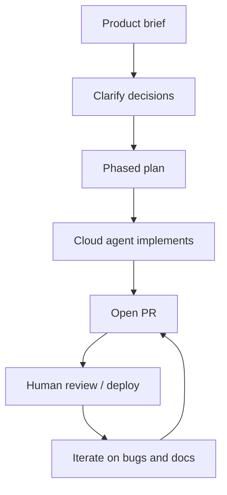

# AI Workflow Note — Workgether

How AI was used to plan, build, and iterate on this project. Written for reviewers who want to understand the process, not only the final code.

## Intent

Use AI as a **fast pair engineer**: clarify product scope, propose a phased plan, implement on a cloud agent when the repo is linked, then fix real bugs from deploy/runtime feedback. Humans keep product decisions, secrets, and final judgment.

## Tools

| Tool | Role in this project |
|------|----------------------|
| Cursor (Plan mode) | Requirements Q&A, phased plan, stack decisions |
| Cursor Cloud Agent | End-to-end scaffold + feature implementation on a feature branch / PR |
| Cursor Agent (follow-ups) | Docs (PRD, README, Vercel), import bugfix, tests, local DB notes |
| GitHub | Branching, PRs, merge to `main` |
| Vercel + Supabase | Deploy target and persistence (cloud or local Supabase CLI) |

## Workflow (high level)

### 1. Brief and constraints

Started from a Google Docs–inspired brief: create/edit/save, rich text, file upload, sharing, persistence, quality bar (README, deploy, tests, architecture note).

Hard constraints locked early:

- Vercel-friendly stack (Next.js)
- Supabase for data
- Username/password auto-register auth
- Lexical (not TipTap) for the editor
- Free realtime if possible; soft sync as fallback

### 2. Decision pass before coding

Used Plan mode to ask scoped questions (collab depth, upload behavior, share model, access roles, editor, DB, save UX). Answers were written into a phased plan so implementation did not thrash on ambiguity.

Example locked choices:

- Share by link with Viewer / Editor
- Home upload → new doc; editor → Attach **and** Import content
- Save + autosave
- No seeded users (auto-register only)

### 3. Cloud implementation

Repo was linked to GitHub (`LeoHub-dev/workgether`), then a **cloud agent** built the app on a feature branch: schema, auth, Lexical editor, share links, uploads, collab wiring, tests, README/ARCHITECTURE.

Human role at this stage: connect the remote, review the PR, supply Supabase/Vercel env vars.

### 4. Deploy feedback loop

Vercel initially failed with “No Next.js version detected” because `main` was still empty (only `.gitignore`) when the project was first imported. Fix was process + docs: merge the app to `main`, set Framework Preset **Next.js**, Root Directory empty, redeploy latest `main`.

### 5. Targeted iteration

Follow-up agent work from concrete issues:

| Signal | AI-assisted response |
|--------|----------------------|
| Missing product write-up | Added `PRD.md` |
| Unclear Vercel/Supabase setup | Expanded README (preset, root dir, where to get `SUPABASE_SERVICE_ROLE_KEY`) |
| Import content “not working” | Traced to Lexical editor ref only set after typing; fixed apply path + clear Yjs state; added import/edit tests |
| Want local DB | Documented `npx supabase start` as cloud replacement; optional `docker-compose` for plain Postgres |

## What AI was good at here

- Turning a loose brief into a **phased, deployable plan**
- Scaffolding a full Next.js + Supabase + Lexical vertical slice quickly
- Writing setup docs and a PRD consistent with the code
- Debugging a specific UX bug (import) with a small, testable fix

## What stayed human-owned

- Product priorities and “keep it lightweight” scope cuts
- Choosing Lexical, Supabase, and share-by-link
- Creating/linking the GitHub repo and cloud credentials
- Merging PRs and validating deploy + demo flows in the browser
- Not committing secrets (service role key, `AUTH_SECRET`)

## Prompts that worked well

1. **Constraints first** — “Vercel free, Supabase, Lexical, auto-register auth, phases.”
2. **Ask then plan** — force decisions (share model, upload behavior) before code.
3. **Cloud for greenfield** — “implement the full plan, open a PR.”
4. **Bugs with symptoms** — “Import content logic is not working” → investigate apply path, not rewrite the product.
5. **Docs as deliverables** — PRD, architecture, local DB, AI workflow note.

## Artifacts produced with AI assistance

| Artifact | Purpose |
|----------|---------|
| [PRD.md](./PRD.md) | Product requirements and success criteria |
| [ARCHITECTURE.md](./ARCHITECTURE.md) | Stack choices and collab fallback |
| [README.md](./README.md) | Setup, Vercel, local Supabase, troubleshooting |
| Feature PRs | Incremental delivery and review |
| `tests/import-content.test.ts` | Regression coverage for file → Lexical import |

## Principles for repeating this workflow

1. **Decide before you generate** — ambiguous sharing/upload/collab choices waste tokens and create rework.
2. **Prefer small iteration loops** after the first vertical slice (deploy → bug → fix → test → docs).
3. **Keep secrets out of chat history commits** — document *where* to get keys, never paste production keys into the repo.
4. **Test the risky path** — import/edit parsing and auth helpers are cheap to unit test and catch silent UI/DB mismatches.
5. **Write the workflow down** — this file is part of the quality bar: show how you work, not only what shipped.

## Out of scope for AI in v1

- Designing brand-new visual systems beyond a coherent lightweight UI
- Operating production Supabase/Vercel accounts
- Guaranteeing realtime CRDT quality without human soak-testing in two browsers
